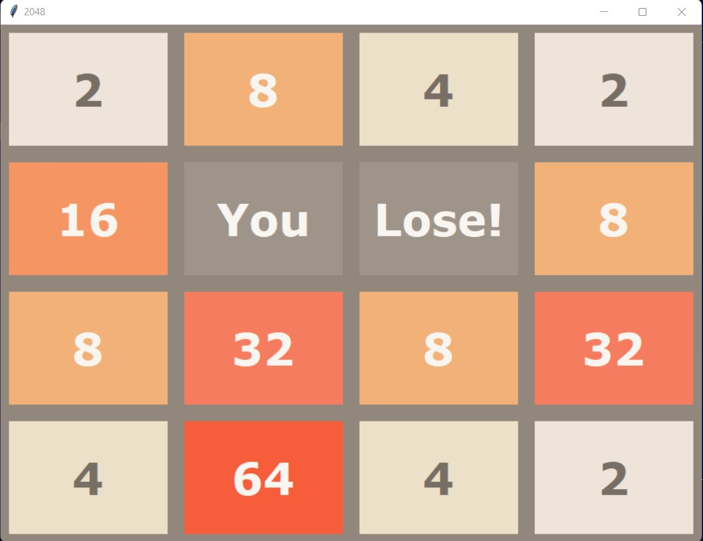

2048 Python
===========

Based on the popular game [2048] by Pranav Rushi T. The game's objective is to slide numbered tiles on a grid to combine them to create a tile with the number 2048. Here is a Python version that uses TKinter! 

To start the game, run:
    
    $ python3 puzzle.py

